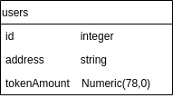

# TestToken minting page

Sequelize + express backend to store useraccount data.

## DB User Model

 
  

## How to run project

1. Run `yarn install` at the root of your directory
2. Run `yarn start` to start the project
3. In `config/config.json` set postgres DB URL
4. Run `yarn nodemon index.js` to run server at PORT 4000 connected to DB at own set postgres URL

## Directory Structure

| Folder     | Content                                      |
| ---------- | -------------------------------------------- |
| config     | Development and Production Database settings |
| migrations | Files to migrate Models to Database          |
| models     | Database models                              |
| seeders    | Seeds to fill Database with dummy data       |
| index.js   | RESTfull API server                          |

### Frontend Repo

[Frontend Repo](https://github.com/Martijncvv/mint-token)
